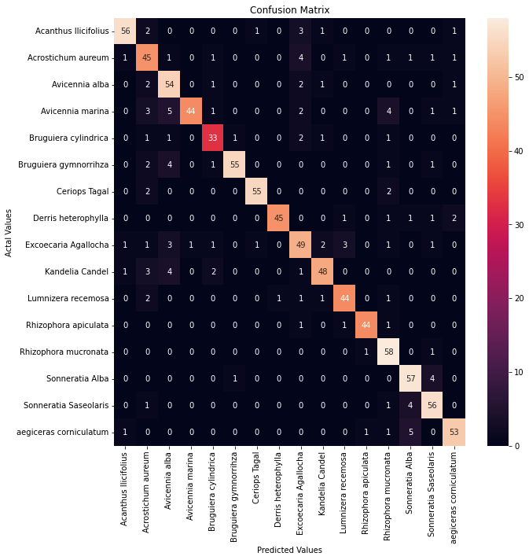
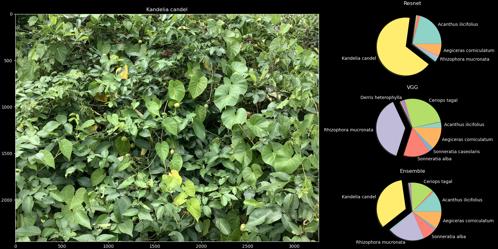
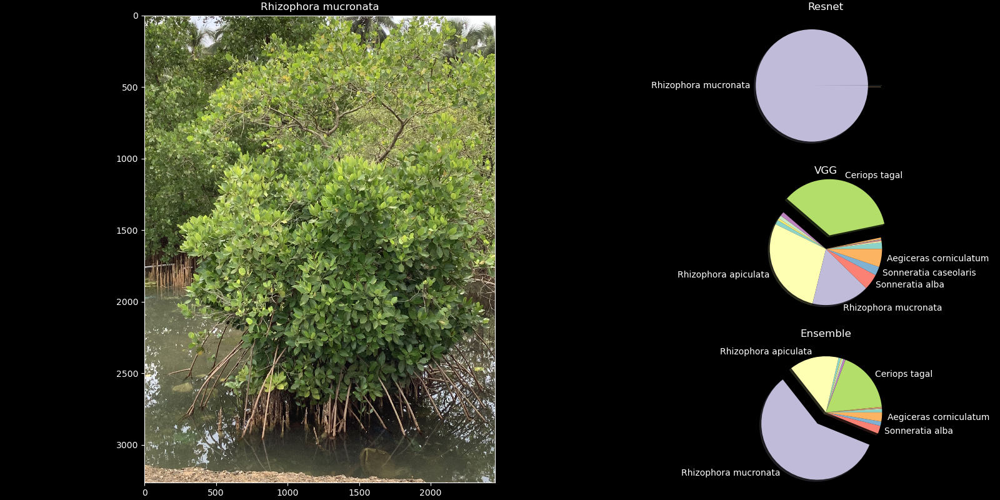

## Forest Department Project (WIP)
This repository contains the `classification` model for the tasks required to be accomplised as a part of the Forest Department Project done by Aerodynamics Club, BITS Goa.

### Classification model (WIP)
We performed Transfer Learning on pretrained `Resnet18` and `VGG` models from Pytorch. We use the ensemble of the two for inference.

| Model         | Epochs trained | Accuracy | F1 Score |
| :---          |       :---:    | :---:    | :---:    |
|`Resnet18`     | 30            |   81.67   | 0.81     |
|`VGG`          | 10             | 83.165   |   0.81   |
|`Ensemble`     | -              | 86.334   |   0.86   |

## Confusion Matrix
 

Confusion matrix generated using the ensemble model.

## Sample Results
The model was tested on real world data collected from our visits to Mangrove forests. More sample results can be found [here]('fig/IMG_0629_test.png')

